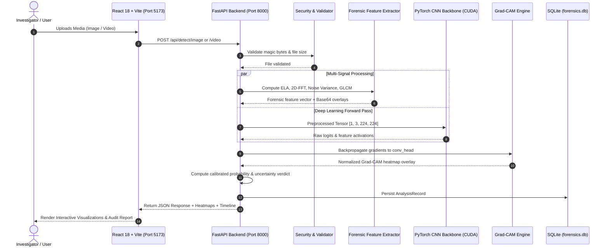

# AuraLens AI: System Architecture Specification

## 1. High-Level Architectural Overview

AuraLens AI implements a decoupled client-server architecture designed for high throughput, modular extensibility, and explainable forensic decision-making.

## 2. Directory & Component Mapping

| Directory / File | Layer | Primary Responsibility |
| :--- | :--- | :--- |
| `backend/app/main.py` | Controller | FastAPI lifecycle, CORS, background worker registration. |
| `backend/app/api/endpoints.py` | Controller | REST route handlers, request validation, database transactions. |
| `backend/app/services/image_detector.py` | Service / ML | EfficientNet-B0 inference, temperature scaling, probability fusion. |
| `backend/app/services/video_detector.py` | Service / ML | OpenCV frame sampling, batch GPU tensor scoring, temporal variance. |
| `backend/app/services/feature_extractor.py` | Service / Forensics | 2D-FFT power spectrum, Error Level Analysis (ELA), Laplacian noise. |
| `backend/app/services/gradcam.py` | Service / XAI | PyTorch hook management, gradient backprop, colormap blending. |
| `backend/app/database.py` | Persistence | Async SQLite engine with SQLAlchemy 2.0. |
| `frontend/src/pages/` | View / UI | Home, Image Forensics, Video Analyzer, Dashboard, History, Evaluation, About. |
| `frontend/src/components/` | View / UI | FileUpload, ResultCard, GradCamViewer, VideoTimeline, ReportModal. |
| `models/metadata.json` | Metadata | Model specifications, threshold configurations, evaluation benchmarks. |
